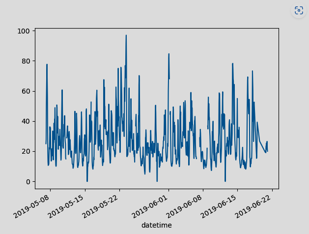

# Plot int Pandas


ในส่วนนี้จะใช้ข้อมูลจาก [air quality no2](https://github.com/pandas-dev/pandas/blob/main/doc/data/air_quality_no2.csv)


อ่านข้อมูลจากไฟล์ data_quality.csv

```py  linenums="1"
import pandas as pd
import matplotlib.pyplot as plt

air_quality = pd.read_csv("data/air_quality_no2.csv", index_col=0, parse_dates=True)
```


สร้าง กราฟจากข้อมูล
```py linenums="5"
air_quality.plot()
plt.show()
```


ถ้าต้องการ filter ดูตามบาง columns
```py linenums="7"
air_quality["station_paris"].plot()
plt.show()
```

