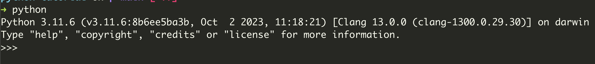

# Introduction to Python

## Example Code

ใช้คำสั่ง print แสดงข้อความ `Hello world`

```py linenums="1"
print("hello ")
```
 

## Download
แนะนำให้ติดตั้ง Python ผ่าน official [Website](https://www.python.org/downloads/)

### ตรวจสอบเวอร์ชัน Python:
```bash linenums="1"
python --version
```

## Running Python Code

### REPL (Read-Eval-Print Loop)
```bash linenums="1"
python
```


### Run ไฟล์ `.py`

```bash linenums="1"
python main.py
```


## Variables and Types
อธิบายเรื่อง primitive type

```py linenums="1"
# Integer
a = 5
print(type(a))
print(isinstance(a, int))

# Float
b = 10.11
print(type(b))

# Boolean
c = True
print(type(c))

# String
d = "Hello"
print(type(d))
```
