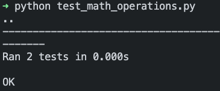

# Unit test

Python มีโมดูล unittest ซึ่งเป็นเครื่องมือสำหรับเขียนและรัน unit test ได้ง่าย


ตัวอย่าง

```sh
project/
├── math_operations.py
├── test_math_operations.py
```

```py  title="math_operations.py" linenums="1"
def divide(a: int, b: int) -> int:
    if b == 0:
        raise ValueError("ไม่สามารถหารด้วยศูนย์ได้")
    return a / b
```

```py title="test_math_operations.py" linenums="1"
import unittest
import math_operations


class TestMyModule(unittest.TestCase):
    def test_given_dividend_and_non_zero_divisor_when_divided_then_correct_result_is_returned(self):
        dividend = 20
        divisor = 4

        result = self.calculator.divide(dividend, divisor)

        self.assertEqual(result, 5.0)

    def test_given_divisor_is_zero_when_divided_then_value_error_is_raised(self):
        dividend = 10
        divisor = 0

        with self.assertRaises(ValueError):
            self.calculator.divide(dividend, divisor)

if __name__ == "__main__":
    unittest.main()
```


ถ้าเรารัน file test  จะได้ผลลัพธ์เหมือนในรูป

```bash
python test_math_operations
```

